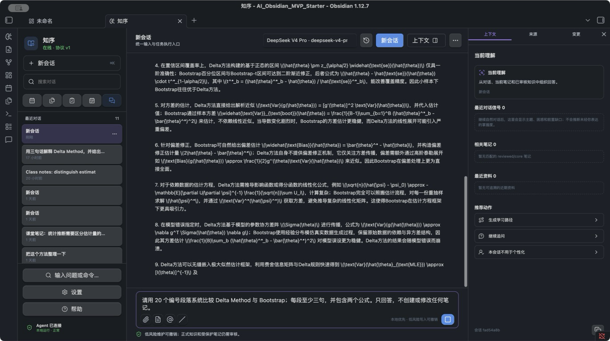
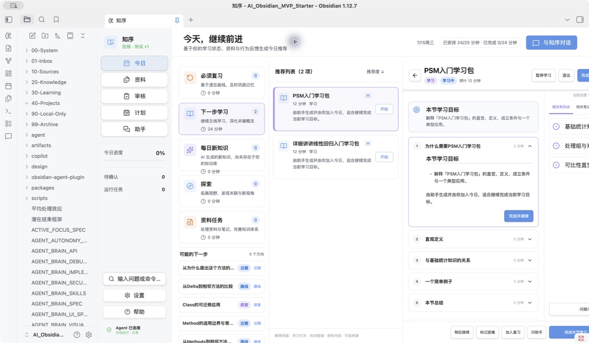
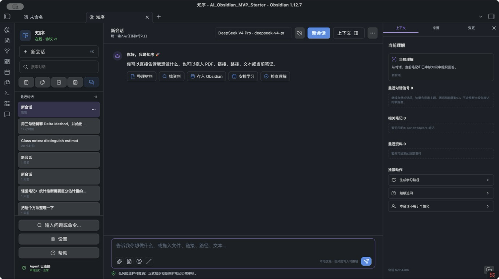
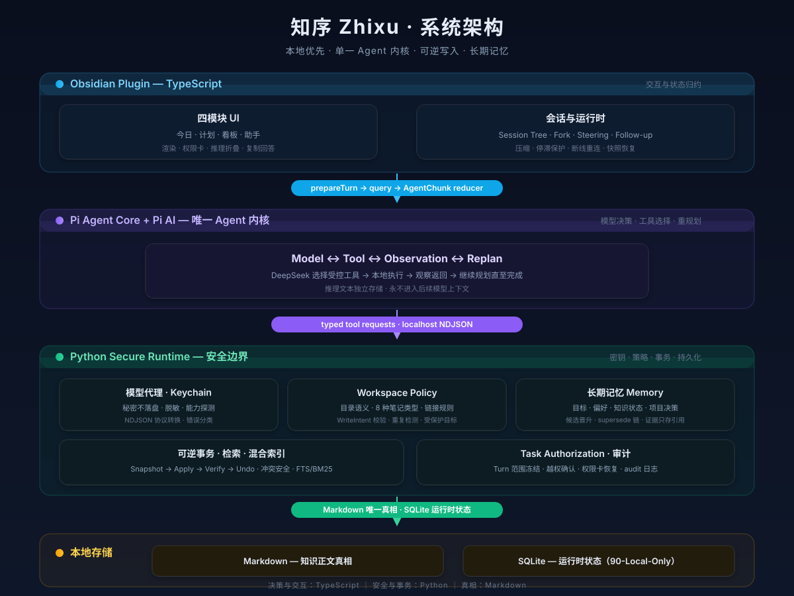

<div align="center">

# 知序 Zhixu

Local-first AI learning agent for Obsidian. 把 PDF、网页和 AI 对话转化为可追溯、可复习的知识，并驱动每日复习与长期学习计划。

[中文 README](README-先读.md) · [Pi Agent Runtime 规范](docs/architecture/PI_AGENT_RUNTIME_SPEC.md) · [路线图](PROJECT_ROADMAP.md) · [决策记录](DECISIONS.md)

</div>

<p align="center">
  
</p>

知序运行在 Obsidian 内部，是一个完整的本地学习闭环：

```
原始资料 (PDF / 网页 / AI 对话)
   ↓  本地提取 + 页码证据
Prepared Bundle
   ↓  结构化校验 + 审核
可追溯知识笔记 (Markdown)
   ↓  review_unit 语义判定
每日复习 + 学习推荐
   ↓  用户确认的掌握度
长期记忆 (目标 / 偏好 / 知识状态)
```

与常见 AI 聊天插件不同，知序关注的是闭环的另一半：生成之后的知识如何被验证、复习和复用。每条结论都携带来源页码；每份写入都经过策略校验和可逆事务；每个可复习单元都由 `review_unit` 属性显式标记，而不是靠目录猜测。

## 功能

### Agent 内核

- 内嵌 [`@earendil-works/pi-agent-core`](https://www.npmjs.com/package/@earendil-works/pi-agent-core) + `pi-ai`，打包在 Obsidian 插件内，无 sidecar
- 会话树 / Fork / Steering / Follow-up / 上下文压缩 / 停滞保护 / 断线重连
- 模型推理文本与最终答案严格分离：思考过程可折叠查看、可独立复制，但不进入后续模型上下文
- Python 侧只负责安全 I/O：模型代理、Keychain、工具执行、授权、事务、检索、持久化

### 写入安全

- 每轮 Turn 冻结可写路径范围（Task Authorization），首次写计划自动绑定，越权需要显式确认
- 写入链路：快照 → 原子写入 → 哈希校验 → Diff → Undo；并发人工编辑优先，不被覆盖
- `reviewed` / `core` 知识只读，自动化只能生成更新建议
- 权限卡是持久化的挂起 Tool Call：重启后恢复，批准 / 拒绝幂等

### Workspace Policy

- 目录语义、笔记类型、写作规则以 Markdown 定义于 `00-System/AI/`
- 每轮注入约 800 token 的规则摘要，另有按需读取工具
- 所有写入先产生结构化 WriteIntent（类型 / 目录 / 更新或新建 / 链接 / 复习单元），经策略校验后进入事务
- 固定目录映射：`concept→Concepts`、`topic→Topics`、`course-chapter→Courses`、`project-note→40-Projects`

### 长期记忆

- 四种记忆类型：目标、偏好、知识状态、项目决策
- 只在用户明确表达时写入（"记住… / 以后请… / 我的长期目标是…"）
- 隐式候选晋升需要 ≥3 条证据、≥2 个不同日期、置信度 ≥0.75
- 冲突走 supersede 链（新 active / 旧 superseded），不原地覆盖
- 证据只存引用（消息 / 测验 / 行为 ID），不复制对话正文

### 学习看板

- 今日 / 计划 / 看板 / 助手四个模块
- 单接口快照：学习时长、知识资产、Agent 工作量、存储分类、SQLite 健康检查
- 复习单元 = `review_unit=true AND status∈{reviewed,core}`；课程长文不进复习，原子概念可以
- 70/30 主线加权，掌握度由用户确认

## 界面

<p align="center">
  
</p>

<p align="center">
  
</p>

更多界面见 `artifacts/`（142 张真实 Obsidian 验收截图：深浅色、窄屏、离线、权限卡、Undo、推理折叠等）。

## 架构

<p align="center">
  
</p>

TypeScript 负责交互与 Agent 决策；Python 负责密钥、策略、事务与持久化。架构测试强制这一边界。

## 快速开始

```bash
# 1. 将仓库目录复制到 Obsidian Vault（先备份同名目录）
#    启用核心插件：Bases / Properties / Templates / Daily notes / Backlinks
#    安装社区插件：Copilot for Obsidian、QuickAdd（PDF 需 Zotero Integration）

# 2. 配置模型
export DEEPSEEK_API_KEY="你的密钥"    # 或使用 macOS Keychain 引用

# 3. 启动本地 Agent（http://127.0.0.1:8765/health）
./scripts/start-agent.sh

# 4. 构建插件
cd obsidian-agent-plugin
npm install --cache .npm-cache
npm test && npm run typecheck && npm run build

# 5. 摄入第一份资料（先 --dry-run 预览，确认后 --apply）
python 00-System/Scripts/ingest_pdf.py \
  --pdf "/path/to/paper.pdf" \
  --vault "/你的/Vault" \
  --kind paper \
  --domain-focus "因果推断" \
  --model deepseek-v4-pro \
  --dry-run
```

推荐模型：`deepseek-v4-pro`（精读 / 计划）、`deepseek-v4-flash`（日常 / 短测）。

每日使用：打开 `00-System/Home.md`，完成 1–3 个到期复习 → 一个学习任务 → 一次 AI 短测。详见[中文 README](README-先读.md)。

## 项目结构

```
00-System/         系统：Home · AI 规则 · Templates · Bases
01-Inbox/          临时输入
10-Sources/        资料出处 (Papers / Books / Courses / Web)
20-Knowledge/      正式知识 (MOCs / Courses / Topics / Concepts)
30-Learning/       学习记录 (Daily / Weekly / Plans)
40-Projects/       项目专属内容
80-Archive/        归档
90-Local-Only/     本地私有（不同步）

agent/             Python 安全运行时
├── core/          service · memory · workspace_policy · learning
├── tools/         受控工具注册
└── api/           localhost HTTP API
obsidian-agent-plugin/   Obsidian 插件 (TypeScript)
docs/              架构 · 验收 · 产品 · UI 规范
```

## 工程文档

| 文档 | 内容 |
|---|---|
| [中文 README](README-先读.md) | 安装配置与每日使用 |
| [Pi Agent Runtime 规范](docs/architecture/PI_AGENT_RUNTIME_SPEC.md) | Agent 内核设计 |
| [Workspace Policy + Memory V1](docs/architecture/WORKSPACE_MEMORY_V1.md) | Vault 语义与长期记忆 |
| [项目状态](PROJECT_STATUS.md) | 当前状态与恢复点 |
| [路线图](PROJECT_ROADMAP.md) | Phase 0–11 与延后项 |
| [决策记录](DECISIONS.md) | D-001 … D-060 |
| [安全模型](SECURITY.md) | 隐私与边界 |

## 质量保证

```bash
./scripts/check.sh
```

- 276 Python 测试：摄入、事务、Pi 运行时、记忆、策略、随机化回归
- 195 插件测试：确定性事件重放、模糊 NDJSON 解析、响应式布局
- 严格 TypeScript typecheck + 生产构建 + 安装产物哈希校验
- 测试不读取真实 PDF、不调用真实模型、不依赖真实密钥

## 贡献

1. Fork 仓库，从 `pi-runtime-hardening-repair` 分支新建功能分支
2. 修改后运行 `./scripts/check.sh`
3. 提交信息遵循现有风格（`feat:` / `fix:` / `docs:` / `refactor:`）
4. 打开 Pull Request

安全敏感改动（密钥、授权、事务）请附架构测试；UI 改动请附真实 Obsidian 截图。

## 安全模型

- 原始 PDF 只在本地读取，模型 API 只接收带 `PAGE` 标记的提取文本
- 密钥只从环境变量 / macOS Keychain 读取，不写入仓库、日志或笔记
- `reviewed` / `core` 永远只读，自动化只能创建更新建议
- 所有写入先结构化校验与完整计划，临时文件 + 原子 rename
- `90-Local-Only` 不同步：提取文本、模型 JSON、更新建议留在本地
